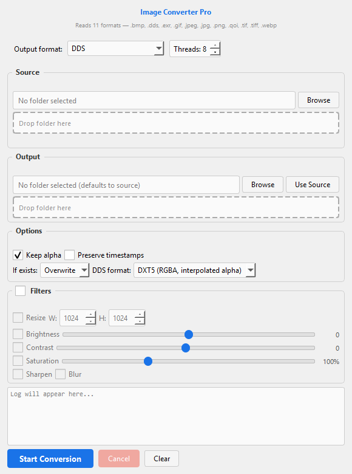
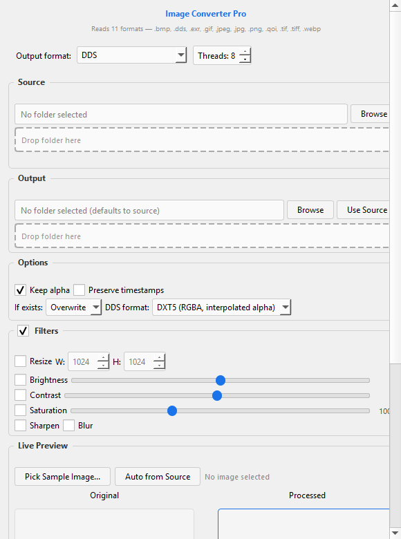

<picture>
  <source media="(prefers-color-scheme: dark)" srcset="screenshot_main.png">
  
</picture>

# Image Converter Pro

Batch image converter with a modern GUI and a full-featured CLI. Reads **11 image formats**, writes **9 output formats**, processes files in **parallel**, and provides **live filter preview**.

```
Reads:  .dds .png .jpg .jpeg .webp .bmp .gif .tiff .tif .avif .heic .heif .exr .qoi
Writes: DDS, PNG, JPEG, WebP, BMP, GIF, TIFF, AVIF, HEIF, QOI
```

---

## Features

**Batch Conversion** — point at a folder, pick a target format, click start. Handles hundreds of files.

**Parallel Processing** — uses `ThreadPoolExecutor` with configurable worker count (default = all CPU cores). 100 images in the time sequential processing takes 15.

**Live Preview** — enable filters, pick a sample image, see original vs processed side by side. Sliders update the preview with 150ms debounce as you drag.

**Image Filters** (applied during conversion and in preview):
- Resize (LANCZOS, configurable W×H)
- Brightness / Contrast / Saturation sliders
- Sharpen / Blur

**Format-Specific Options** — dynamic controls that appear only for the selected output format:
- **PNG**: compression level 0–9
- **JPEG**: quality 1–100
- **WebP**: quality + lossless toggle
- **TIFF**: None / LZW / Deflate compression
- **DDS**: DXT1, DXT3, DXT5, BC7, Uncompressed RGBA
- **AVIF / HEIF**: quality 1–100

**Per-File Overwrite Control** — Overwrite, Skip, or auto-Rename with numbered suffixes.

**Alpha Channel** — keep or strip RGBA on any format that supports it.

**Drag & Drop** — drop folders onto the dashed drop targets.

---

## Screenshots

| Main window | Filters & preview |
|-------------|-------------------|
|  |  |

---

## Installation

### From source (pip)

```bash
pip install PyQt5 Pillow
git clone https://github.com/moh-saidi/DDS-PNG-PNG-DDS-Converter.git
cd DDS-PNG-PNG-DDS-Converter
python main.py
```

Optional plugins for extra formats:
```bash
pip install pillow-avif-plugin   # AVIF support
pip install pillow-heif          # HEIF/HEIC support
```

### From source (package install)

```bash
cd DDS-PNG-PNG-DDS-Converter
pip install -e .
img-converter                     # launch GUI
img-converter --help              # CLI mode
```

### Standalone .exe

```bash
pip install pyinstaller
python build_exe.py
# → dist/ImageConverter.exe
```

---

## Usage

### GUI

```
python main.py
```

Or if installed:
```
img-converter
```

1. Select **Output format** from the dropdown
2. Choose **Source folder** (browse or drag & drop)
3. Choose **Output folder** (or click "Use Source")
4. Tweak **Options** (alpha, timestamps, overwrite)
5. Expand **Filters** to enable resize/brightness/contrast/saturation/sharpen/blur
6. Click **Start Conversion**

### CLI

```
python -m img_converter --input ./textures --output ./out --format webp --threads 8
```

Full CLI options:

| Flag | Description |
|------|-------------|
| `-i, --input` | Source file or directory |
| `-o, --output` | Output directory (defaults to input) |
| `-f, --format` | Output format (DDS, PNG, JPEG, WebP, BMP, GIF, TIFF, AVIF, HEIF, QOI) |
| `-r, --recursive` | Scan subdirectories |
| `-t, --threads` | Worker thread count (default = CPU count) |
| `--force` | Overwrite existing files |
| `--strip-alpha` | Remove alpha channel |
| `--no-timestamps` | Don't preserve file modification times |
| `--png-compress` | PNG compression level |
| `--jpeg-quality` | JPEG quality 1–100 |
| `--webp-quality` | WebP quality 1–100 |
| `--tiff-lzw` / `--tiff-deflate` | TIFF compression |
| `--dds-format` | DDS compression format |
| `--avif-quality` / `--heif-quality` | AVIF/HEIF quality |
| `--resize` / `--resize-width` / `--resize-height` | Resize dimensions |
| `--brightness` / `--contrast` / `--saturation` | Filter adjustments |
| `--sharpen` / `--blur` | Filter toggles |

---

## Project Structure

```
src/img_converter/
├── __init__.py     # Version info
├── __main__.py     # CLI + GUI entry point, argparse
├── formats.py      # Format registry, extension map, compression constants
├── filters.py      # Image processing pipeline (apply_filters, prepare_image, pil_to_pixmap)
├── worker.py       # ConverterWorker — parallel batch engine (ThreadPoolExecutor)
└── ui.py           # PyQt5 GUI — ConverterApp, DropLine, live preview
```

---

## Requirements

- Python ≥ 3.8
- PyQt5 ≥ 5.15
- Pillow ≥ 9.0
- *Optional:* `pillow-avif-plugin`, `pillow-heif`

---

## License

MIT
